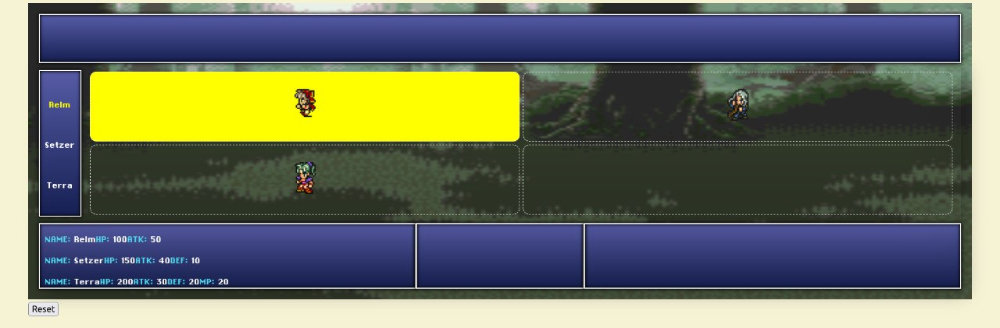

# Tarea 0 - Introducción a Scala y Git

La idea de esta primera entrega es que se familiaricen con el lenguaje Scala,
así como el manejo de Git. La finalidad es que sean capaces de ejecutar tanto el
_front-end_ (opcional) como el _back-end_ del proyecto.

## GameController

Esta entrega consiste en crear de manera _hard-coded_ un estado de juego inicial
para que después lo puedan visualizar con el _front-end_.

Dentro del repositorio se encuentra un archivo llamado GameController y otro
IGameController. El segundo corresponde a la **interface** o **trait** del
primero y cumple con ser una pauta de lo que deben implementar para esta
entrega.

**IMPORTANTE: NO DEBE MODIFICAR NINGÚN ARCHIVO DENTRO DEL PAQUETE `api`**

Ustedes deben recrear el siguiente escenario:



Deberán leer el archivo `util.Json_Guide.md` para poder realizarlo.

Donde hay:
- Tres personajes:
    1. "Relm" cuyo id es "c1", tiene 100 puntos de "hp" y 50 de "atk".
    2. "Setzer" cuyo id es "c2", tiene 150 puntos de "hp", 40 de "atk" y 10 de
       "def".
    3. "Terra" cuyo id es "c3", tiene 200 puntos de "hp", 30 de "atk", 20 de
       "def", y 20 de "mp".

- Cuatro paneles:
    1. Panel "p1" en (1, 1) donde está Relm
    2. Panel "p2" en (2, 1) donde está Setzer
    3. Panel "p3" en (2, 2) donde no hay nadie
    4. Panel "p4" en (1, 2) donde está Terra

- Y dos jugadores:
    1. Jugador 1 que tiene a Relm, Setzer y Terra
    2. Jugador 2 que no tiene personajes

## Git
Para la correcta inicialización de su trabajo en este proyecto, debe realizar
las siguientes instrucciones:

1. Seguir el enlace de *GitHub Classroom* que se les ha entregado para crear un
   repositorio privado con los archivos base del proyecto.

2. Clonar el repositorio en su computador. Para esto, utilice el comando
   ``git clone <url>``. Una vez situado en el directorio en el que trabajará

**IMPORTANTE**: Usted debe abrir IntelliJ desde la carpeta que clonó, es decir,
la que tenga el nombre PENDIENTE. Hacerlo desde la carpeta que contiene a esta
no permitirá el correcto funcionamiento de la aplicación.

3. Crear una rama llamada ``entrega-final-0``.

    - Para esto, utilice el comando ``git branch <branch_name>``. En este caso,
      sería ``git branch entrega-final-0``.

    - Para que su progreso pueda ser almacenado en dicha rama (y no en la rama
      main u otras), debe utilizar el comando ``git checkout <branch_name>``. En
      este caso, sería ``git checkout entrega-final-0``. A esto se le conoce
      comúnmente como "cambiarse de rama".

*Tenga en cuenta que el cuerpo docente tiene acceso total a su repositorio.*

## Entrega
Para subir su entrega, deberá crear un *pull request* desde la rama
``entrega-final-0`` a la rama ``main`` llamado ``Tarea 0 - Entrega Final``.

Es importante que **no hagan merge** de la rama ``entrega-final-0`` a la rama
``main`` para que el cuerpo docente pueda revisar su *pull request*.

Por *U-Cursos* debe entregar un único archivo llamado ``entrega-final-0.txt``
con el siguiente contenido:

```
Nombre: <Nombre completo>
Pull Request: <Link del pull request>
```

La realización de esta entrega es **obligatoria** y corresponde al 10% de la
nota de Tareas.
